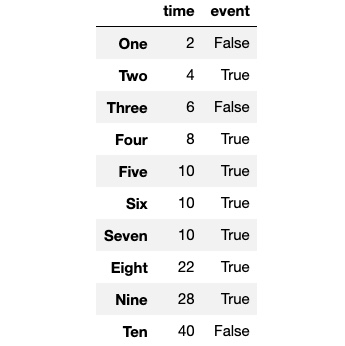
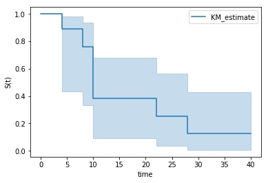

# 이탈분석 기초 어휘 정리

- **시간** (time) : 생존분석을 시행할 때 주로 시간 경과에 따른 위험도나 생존도를 구하는데 이 때 두는 독립변수로 시간이 있다. 상대적 시간이며, 분석하고자 하는 대상을 관찰하기 시작한 시점부터 0으로 카운트 됨
  - 대상을 관찰하기 시작한 시점으로부터 경과한 시간을 의미합니다.
- **사건** (event) : 보통 생존의 반대인 이탈, 죽음 등을 가리키며, 이것들이 생존 분석으로 분석하려는 대상이 되어 시간과 함께 종속 관계를 맺음. 사건은 한번만 일어나게 되며 0과 1로 보통 구분이 됨
- **중도절단** (censoring / censored)
  - 중도절단은 Survival Analysis에서 손실된 데이터를 처리하기 위해 도입된 개념으로, Right Censored와 Left Censored로 구분됩니다.

    - **우측 중도절단** (Right censored) : 어떤 특정 기간 내에도 사건이 발생을 하지 않았거나, 기타 다양한 이유로 관찰이 종료된 것을 의미 
      - 특정 사건이 발생한 시점이 특정 시기(연구가 끝난 시기) 이후인 경우


    - **좌측 중도절단** (Left censored) : 대상 관찰 전에 사건이 일어났거나 (영어에서는 event occurred 또는 failed to the event 라고 표현함) 기대했던 최소한의 기간보다 생존 시간이 더 짧았던 경우
      - 특정 사건이 발생한 시점이 특정 시기(연구 기간)에 미치지 못한 경우
- 생존 함수(Survival Function) : 특정 시기보다 더 오래 생존할 확률을 추정합니다.
- 위험 함수(Hazard Function) : 특정 시기에 사건이 발생할 확률을 추정합니다.

  - t 전 시간까지는 사건이 발생해서는 안됨
- **누적위험함수** ( Cumulative hazard function) : 0 ~  t 시간 사이의 위험함수를 적분한 값이며, 이는 t시점까지 사건이 발생할 확률을 모두 더한 것과 같다.

---

# Univariate method(단변량 추정법)

- 결과값 **Y**(보통 종속변수라고 하며, 결과변수, 반응변수라고도 불린다)가 하나일 때 이를 단변량이라고 한다
- 두개 이상이면 다변량 분석이 된다
- 공변량(covariate)으로 정의 되는 **X**(독립변수, 설명변수, 예측변수, 위험 인자)가 하나일 때는 단순이고 두 개 이상이면 다중이라고 한다.
- 즉 , 요약하면 X가 1개 = 단순 , X >= 2 면 다중 / Y가 1개 = 단변량 , Y>=2 는 다변량


#  Kaplan-Meier 추정법 (KM) = 누적한계추정법(Product Limit Method)

- 일반적으로 생존 함수는 Kaplan-Meier Estimation 방법을 통해 추정
- 적은 표본에 대해서도 적용할 수 있기 때문에 폭넓게 사용됨 
- Kaplan-Meier Estimation 방법을 통해 집단 간의 시간에 따른 생존율을 쉽게 비교
- 전체 연구 기간 동안에 사건이 발생한 시점마다 구간생존율을 산출하여 최종적으로는 누적생존율(empirical cumulative density function (eCDF)을 사용하여 누적 생존확률을 추정)을 산출
  - 사건의 관찰기간 순서대로 자료를 정렬한 뒤, 각 구간별로 관찰대상 수 중 생존자수의 비율로 구간생존율 $P(t)$를 산출
  -  관찰기간동안 1명이 사망한 경우, 구간생존율은 $\frac{n-1}{n}$이 된다.
  -  누적생존율 $S(t)$는 구간별 구간생존율을 차례대로 곱하여 산출할 수 있다.
  -  구간생존율과 누적생존율의 세부 공식은 아래와 같다.
 
 ---

 ## Kaplan-Meier Curve 그리기

- 예제 데이터 생성



```py
from lifelines import KaplanMeierFitter

kmf = KaplanMeierFitter()
kmf.fit(data['time'], data['event'])

plot = kmf.plot_survival_function()
plot.set_xlabel('time')
plot.set_ylabel('S(t)')
plot
```


- Python의 ***lifelines*** 라이브러리를 활용하면 Kaplan-Meier Curve를 그릴 수 있으며, Curve를 통해 특정 시점의 생존율을 추정할 수 있습니다.
-  생존 확률 y는 0에서 1사이의 값을 가지며 보통 하향곡선을 그린다.

- plot_survival_function() 함수를 통해 Kaplan-Meier 곡선을 그릴 수 있습니다. X축은 시간이며, Y축은 누적생존율 $S(t)$를 나타내도록 하였습니다.



# Kaplan-Meier Curve 해석
- 생성된 Kaplan Meier Curve를 통해 다양한 의사결정을 내릴 수 있습니다. 편의를 위해 시간의 단위는 월(**Month**)로 지칭하겠습니다.

1) 관찰 시작부터 관찰 종료 시점까지 **점차 누적생존율이 떨어지는 것**을 확인할 수 있습니다.

2) 관찰 시작 **10개월이 지난 시점에 생존율이 급격하게 떨어지는 것을 확인**할 수 있습니다.

3) **1년이 지난 시점에서의 생존율은 약 40%, 2년이 지난 시점에서의 생존율은 30% 정도로 추정**할 수 있습니다.


---

# 레퍼런스

[생존 분석으로 고객 이탈 모델링 링크](https://medium.com/@zachary.james.angell/applying-survival-analysis-to-customer-churn-40b5a809b05a_)

[Survival Analysis. 카플란-마이어 추정 (Kaplan Meier Estimation)](https://sticky-ai.github.io/survival%20analysis/2020/07/29/survival_analysis_kaplan_meier/)


